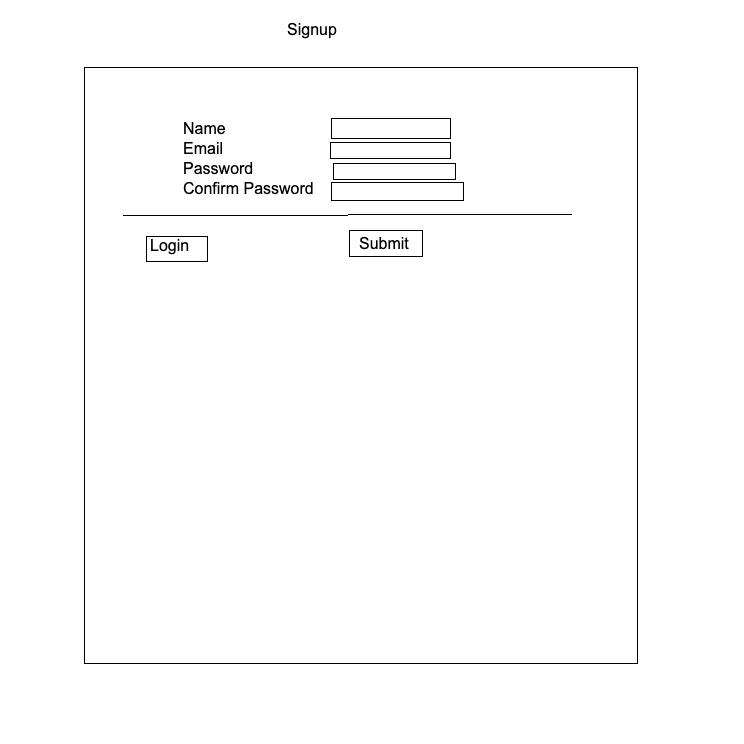
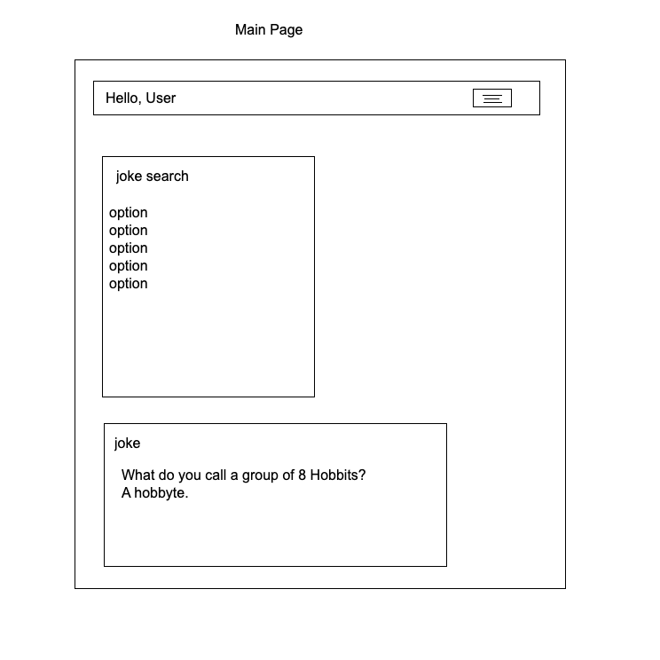
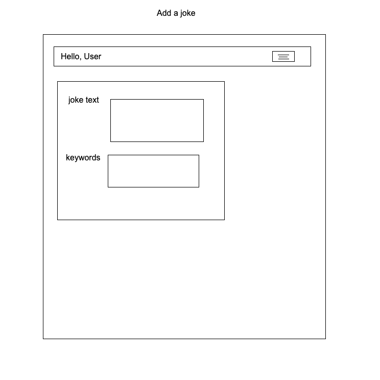
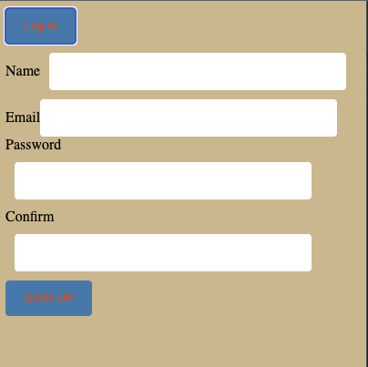
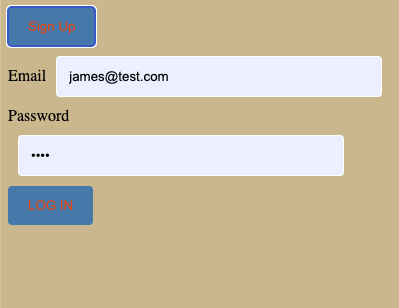
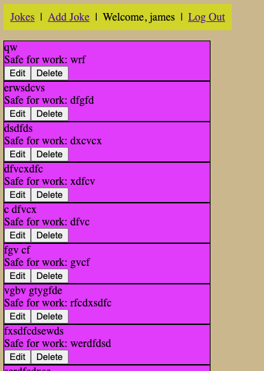
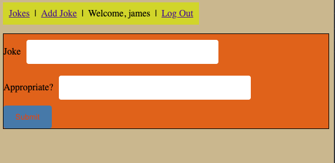

# Jokes Collection
I built this app co i can input jokes into it and maintain the collection by editing or deleting jokes from its database.

### ERD

### Wireframe

### Screenshots

### Technologies Used
HTML, CSS, Java Script, JWT, MongoDB, React, Node.js. 

### Getting Started
Trello: https://trello.com/b/raPyxPMg/project-3
Deployment: to be added soon!

### Next Steps
Id like to impliment a third party API that contains lots of jokes. Also I think if you could implement A third party Api with funny GIF's, it would really add to the app.